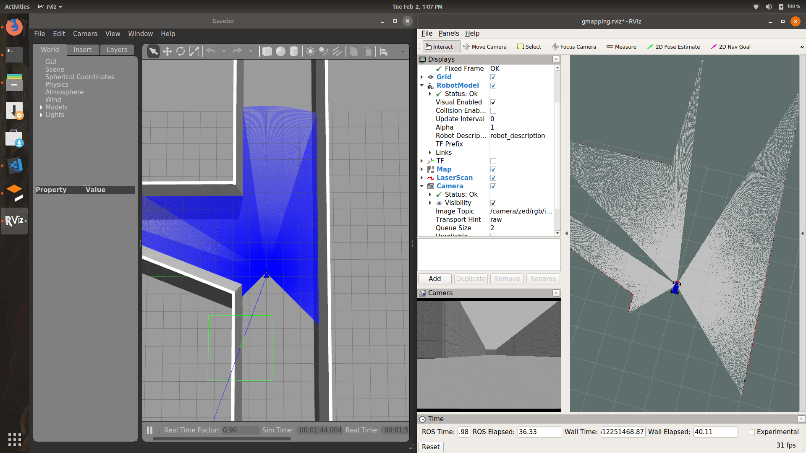
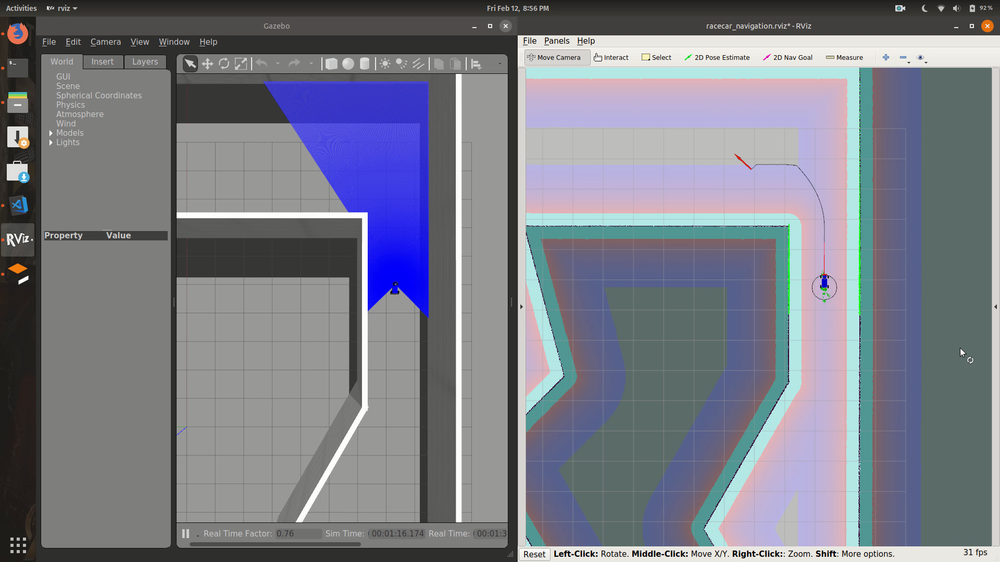

# racecar-env

mit-racecar environment to test motion planning algorithms. 

## Prerequisites

- [racecar](https://github.com/mit-racecar/racecar)
- [racecar_gazebo](https://github.com/devanshdhrafani/racecar_gazebo) (modified)
- [ackermann_msgs](http://wiki.ros.org/ackermann_msgs)
- [effort_controllers](http://wiki.ros.org/effort_controllers)
- [joy](http://wiki.ros.org/joy)


## Gmapping

1. $ `roslaunch racecar-env racecar_tunnel.launch`
2. $ `roslaunch racecar-env gmapping.launch `
3. $ `rosrun racecar_control keyboard_teleop.py`




## Navigation Stack

```bash
$ roslaunch racecar-env racecar_navigation.launch 
```


